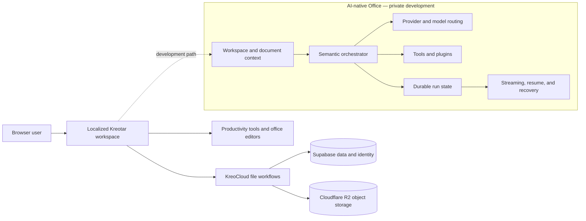

# Kreotar

Kreotar is a live, browser-based productivity ecosystem that brings cloud files, office-style editors, visual collaboration, and focused web tools into one workspace.

**Status:** Active live product. A next-generation AI-native workspace is under active private development.  
**Product:** [kreotar.com](https://kreotar.com/)

## Live Today

The current product is available in the browser and includes:

- **KreoCloud** for free file storage and cloud workspace flows
- **KreoPDF** for PDF-focused tasks
- **KreoDoc** for document editing
- **KreoSheets** for spreadsheet work
- **KreoSlides** for presentations
- **KreoBoard** for visual collaboration
- A collection of focused browser utilities for common file and productivity tasks

These are current product surfaces. They are intentionally described separately from the AI-native Office architecture below, which is not yet the public product experience.

### Multilingual product architecture

Kreotar is organized around approximately 30 locales and language markets. This is a product-engineering concern rather than a collection of literal translations: locale-aware routing, interface and content management, product naming, and language-market consistency all need to remain aligned across a growing set of tools and editors.

## AI-Native Office — In Development

A deeper AI-native Office layer is being developed privately. Its goal is to let AI work with the workspace itself: creating files, operating on existing documents, and using document and workspace context while a task is running.

The private implementation includes engineering around:

- semantic request interpretation and orchestration
- provider and model routing
- tool and plugin execution
- document and workspace context integration
- durable workflow and run state
- streamed progress and results
- continuation, resume, and recovery behavior

This work is under active development. It should not be read as a claim that these capabilities are already available in the live product.

## Architecture

The diagram is intentionally high level. It communicates system boundaries without exposing proprietary prompts, credentials, provider configuration, or private implementation details.

## Engineering Focus

- Keeping cloud-file operations, editors, and focused tools coherent inside one browser-first product
- Designing stateful AI workflows that can continue or recover rather than treating every request as a stateless chat turn
- Separating model interpretation from explicit tool execution and document operations
- Maintaining a consistent product structure across approximately 30 locale and language-market surfaces
- Integrating Next.js and TypeScript application code with Supabase and Cloudflare infrastructure

## Technology Surface

Next.js, TypeScript, Supabase, Cloudflare, R2 object storage, browser-based editor runtimes, and private AI orchestration services.

## Source and Privacy

This repository is Kreotar's public product and engineering overview. The core commercial application source and the next-generation AI implementation remain private. No proprietary application code, production configuration, private prompts, credentials, or customer data is published here.

## Ownership

Kreotar is independently designed and developed by **Göktürk Kahriman**, Full-stack & AI Systems Developer.
